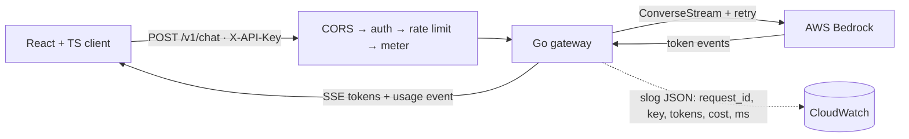
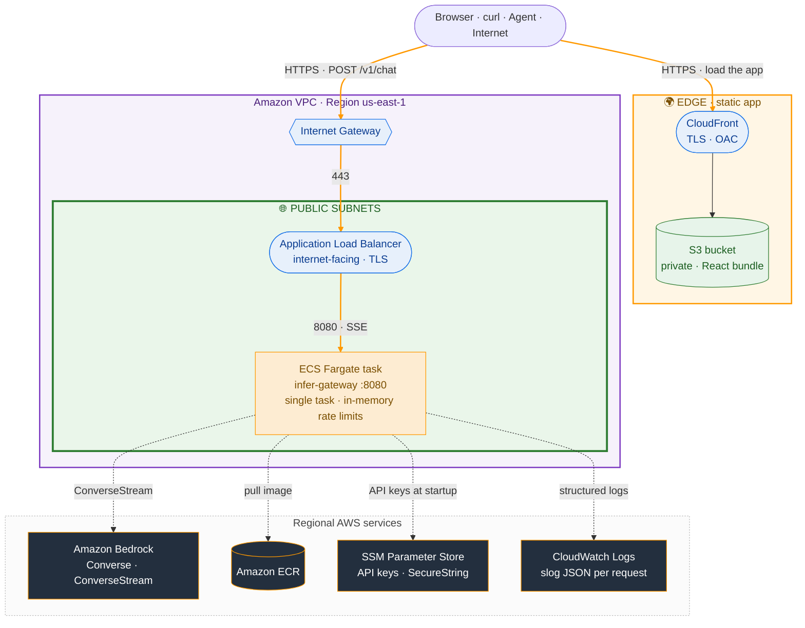

# infer-gateway

[](https://github.com/Go-Santiago-Go/inference-gateway/actions/workflows/ci.yml)
[](https://github.com/Go-Santiago-Go/inference-gateway/actions/workflows/deploy.yml)

**A production-shaped inference gateway in Go that sits in front of AWS Bedrock.** I built it to add
the operations layer that raw Bedrock lacks: Server-Sent Events token streaming, per-key API-key auth,
per-key rate limiting, retries with backoff and jitter, and per-request token and cost accounting, all
observable through structured `slog` logs.

I call Bedrock behind a `Generator` interface and keep every cross-cutting concern in its own
middleware, so I can unit test the pipeline with zero cloud access and the handler stays a thin piece
of orchestration. I also wrote a React and TypeScript client that streams from the gateway in the
browser, so each of those features is visible on screen rather than only in a log line. Built to be
consumed by a human, a browser, or an agent.

One streaming endpoint, plus probes:

- `POST /v1/chat` streams a Bedrock completion back token by token over SSE, ending with a `usage`
  event that carries the request's token counts, cost, and latency. The request is authenticated by
  API key, rate limited per key, and retried on transient failures.
- `GET /health` and `GET /ready` for liveness and readiness.

> **Project status:** I built this local-first, phase by phase, then **deployed it to AWS and verified
> it end to end.** `terraform apply` provisions the gateway on ECS Express Mode and the client on S3
> behind CloudFront. Against the live URLs I confirmed a browser streams a Bedrock answer token by
> token, Stop cancels it mid-stream, an invalid key returns `401`, and a burst returns `429` with an
> accurate `Retry-After`. I tear the stack down with `terraform destroy` after each session rather than
> paying to leave it idle, so the URLs are regenerated per deploy instead of kept always-on. See
> [DEPLOYMENT.md](DEPLOYMENT.md) to stand it up in your own account.

## Architecture

The service, end to end:



I route every request through a chain of composable middleware. Cross-cutting concerns (CORS, auth,
rate limiting, logging, metering) each wrap the next, so the handler stays a thin piece of
orchestration and I can test each concern in isolation. I put the Bedrock client behind a Go
interface, so I can test handlers against a fake and swap models without touching handler code.

**Streaming without burning tokens.** `POST /v1/chat` relays Bedrock `ConverseStream` events onto a
channel, and the handler writes each as a `data:` frame flushed immediately with `http.Flusher`, then
emits a final `event: usage` frame. I thread the request context from the handler through the
`Generator` into the SDK call, so a client disconnect (or the client's Stop button) cancels the
in-flight Bedrock call and the retry loop instead of paying for tokens nobody reads.

### Deployment (AWS)

I run the container on **Amazon ECS Express Mode on Fargate**: from an image plus three IAM roles,
Express Mode provisions the Fargate service, an internet-facing load balancer with TLS, autoscaling,
health checks, and the security-group wiring between the load balancer and the task, and hands back a
public `*.ecs.<region>.on.aws` URL. There is no database and no data tier: rate-limit state lives in
the task's memory, so the request path is just the load balancer and the app.

The React client is a static bundle, so I serve it separately: a private S3 bucket fronted by
CloudFront, reachable only through the distribution via an Origin Access Control. The browser
therefore talks to two origins, CloudFront for the app and the load balancer for the API, which is
why I wire the gateway's CORS allowlist to the distribution's domain at apply time.



The orange paths are the two things a browser does: **load the app** from CloudFront, then **call the
API** through the Internet Gateway and load balancer into the ECS task. The dashed lines are the
task's outbound calls: Bedrock for inference, ECR for the image at launch, SSM for the API keys
injected at startup, and CloudWatch for the structured logs. A multi-stage Docker build ships a
distroless binary (8.6 MB compressed) for a small image and attack surface, and GitHub Actions builds
and pushes it to ECR over GitHub OIDC, with no stored AWS credentials.

**Three honest constraints.** First, the ALB idle timeout is 60 seconds and Express Mode does not
expose it as a tunable. In practice streams finish in one to two seconds, and it is an *idle* timer
that resets on each byte, so it is never approached; a model that stalled longer than 60 seconds
before its first token would need a heartbeat comment frame, which is a stretch item rather than
something built. Second, the token-bucket limiters live in the task's memory, which is only globally
correct while a **single task** serves traffic; scaling out would split each key's budget across
tasks, so multi-task correctness needs shared state in Redis. Third, Express Mode places the tasks in
public subnets in order to give the load balancer a public URL; the tasks have public IPs but stay
unreachable because their security group admits only the load balancer. Keeping them fully private
would mean dropping to a hand-rolled `aws_ecs_service`.

The `infra/` directory holds two Terraform stacks, split by lifetime:

- **[`infra/bootstrap/`](./infra/bootstrap)** provisions the free, long-lived pieces: the ECR
  repository and the GitHub OIDC CI role. Apply it once and leave it up, so CI can push images at any
  time and images survive the app stack's teardown.
- **[`infra/`](./infra)** provisions the billable app stack: the ECS Express service and its
  infrastructure role, the task and execution roles, the API keys as an SSM `SecureString`, the
  CloudWatch log group, and the S3 and CloudFront hosting for the client. It looks the ECR repository
  up by name, so bootstrap must be applied first. This is the stack you destroy after each session.

```bash
# Once: the persistent stack (free: ECR repository + CI role)
cd infra/bootstrap && terraform init && terraform apply

# Each session: the billable app stack (about 10 to 15 min; Express Mode waits
# for health checks, CloudFront takes a few minutes to deploy)
cd infra && terraform init && terraform apply
terraform output gateway_url   # the live API URL
terraform output client_url    # the hosted client
terraform destroy              # tear the app stack down when done
```

The only meaningful cost while up is the Express Mode load balancer (roughly $0.02 per hour);
CloudFront and S3 fall inside the always-free tier at this scale, and there is no database. A
`destroy` after each session keeps the bill at pennies.

For a step by step clone and deploy walkthrough (Bedrock model access, both stacks, pushing an image,
building and uploading the client, and teardown), see [DEPLOYMENT.md](DEPLOYMENT.md).

## Design decisions

I optimized every choice below for one constraint: the simplest component that satisfies the
requirement, reaching for managed or heavyweight infrastructure only where the workload genuinely
demands it. I put the decisions that are not load-bearing behind interfaces, so I can change them
later without disturbing the core.

| Decision | Choice | Why | Also considered |
|---|---|---|---|
| Token streaming | SSE over plain HTTP | Flow is one-directional server to client; plain HTTP works through ALBs and `curl` with no handshake | WebSockets |
| Client stream read | `fetch` + `ReadableStream` | `EventSource` only issues `GET`; `/v1/chat` is a `POST` with a JSON body | `EventSource` |
| Rate limiting | In-memory token bucket per key | A single task makes per-key limiters correct and defensible, with zero extra infrastructure | Redis, leaky bucket, sliding window |
| Rate-limit state | In-process (`sync.Map` of limiters) | No database in the MVP; the multi-task answer is Redis, and it is a stretch item | Redis-backed shared state |
| Retries | Backoff + jitter, transient only | Retrying a `4xx` just wastes calls; jitter avoids a thundering herd on the backend | Retry everything, fixed backoff |
| Retry ownership | Own loop, SDK retryer disabled | Two retryers nest to 9 calls per request on stacked schedules; one explicit loop keeps call counts predictable | Tune the SDK's `retry.Standard` |
| Bedrock access | Behind a `Generator` interface | Handlers test against a fake with no AWS, and models swap without touching handler code | Call the SDK directly |
| Cross-cutting concerns | Middleware chain | Auth, limits, metering, and logging each stay testable in isolation and the handler stays thin | Logic inside handlers |
| Compute | ECS Express Mode on Fargate | Managed networking, load balancing, and scaling from an image; App Runner is closed to new customers | Full ECS Fargate |

The pattern under all of it is **dependency inversion at the boundaries**: the request path depends on
a `Generator` interface, and I plug the concrete Bedrock client in at `main`. That is what lets me
test the whole pipeline with a fake generator and no cloud, and swap the model or provider without
touching handler code.

## Status

I built this local-first, phase by phase. I check a box below only where the work is done and
verified end to end.

- [x] HTTP server on `net/http` (Go 1.22 routing), `GET /health` and `GET /ready`, one structured
  `slog` JSON line per request, and CORS with preflight handling (Phase 1)
- [x] `POST /v1/chat` non-streaming Bedrock Converse completion, metered into a per-request
  `cost_usd`, all behind a `Generator` interface with a fake in tests (Phase 2)
- [x] Per-key API-key auth in middleware: unknown or missing `X-API-Key` rejected with `401` before
  any Bedrock call; the valid key threads into the log line (Phase 3)
- [x] SSE token streaming with a final `event: usage` frame; client disconnect cancels the upstream
  Bedrock call (Phase 4)
- [x] Per-key rate limiting with a token bucket: `429` plus a `Retry-After` header, verified under
  concurrent load (Phase 5)
- [x] Retries with exponential backoff and jitter, transient errors only, cancellable mid-backoff,
  with tests in CI (Phase 6, the MVP cut line)
- [x] React and TypeScript client: live SSE streaming read with `fetch` + `ReadableStream`, a Stop
  button backed by `AbortController`, the request lifecycle modeled as a discriminated union with
  clean `401`/`429` states, per-request and cumulative-conversation cost, multi-turn conversations,
  Markdown rendering, and a dark/light theme, all with WCAG-AA-verified contrast (Phase 7)
- [x] Terraform for the AWS resources the deploy needs: an ECR repository, the task and execution IAM
  roles with least-privilege policies (scoped Bedrock invoke, scoped SSM read), and the API keys in an
  SSM `SecureString`; `terraform apply`/`destroy` are clean and idempotent (Phase 8)
- [x] Containerized in a multi-stage build to a distroless image (8.6 MB compressed, runs as
  `nonroot`), pushed to ECR by GitHub Actions over OIDC with no stored AWS credentials, and deployed
  on ECS Express Mode with the client on S3 behind CloudFront. Verified against the live URLs:
  streaming, Stop, `401`, and `429` with `Retry-After` (Phase 9)

## Stack

- **Go** for the service (standard library `net/http` 1.22 routing and `log/slog`, no framework).
- **AWS Bedrock** for inference via the Converse and `ConverseStream` APIs.
- **Server-Sent Events** for token streaming, read on the client with `fetch` + `ReadableStream`.
- **`golang.org/x/time/rate`** for the per-key token-bucket limiter.
- **React + TypeScript (Vite)** for the client that exercises the gateway in a browser.
- **Docker** to containerize, **Terraform** for infrastructure, **GitHub Actions** for CI/CD to ECR.
- **ECS Express Mode on Fargate** to run it.

## Local development

The fastest path is local. The Go service runs natively and talks to Bedrock, so you need no local
database and no container to see the full request path. It does call Bedrock, so the machine running
it needs AWS credentials with **Bedrock access** and a Converse-stream model enabled in the region.

**Prerequisites.** [Go 1.26+](https://go.dev/doc/install), [Docker](https://docs.docker.com/get-docker/),
and AWS credentials configured (`aws configure`) with
[model access](https://docs.aws.amazon.com/bedrock/latest/userguide/model-access.html) enabled for a
Claude model in your region.

```bash
# 1. Clone
git clone https://github.com/Go-Santiago-Go/inference-gateway.git
cd inference-gateway

# 2. Configure. The server refuses to boot without at least one API key.
export AWS_REGION=us-east-1                                            # region where Bedrock model access is enabled
export API_KEYS=testkey                                               # comma-separated valid keys
export BEDROCK_MODEL_ID=us.anthropic.claude-haiku-4-5-20251001-v1:0    # optional; this is the default
export RATE_LIMIT_RPS=2                                               # optional; per-key refill rate (req/s), default 2
export RATE_LIMIT_BURST=5                                             # optional; per-key bucket size, default 5

# 3. Run the service. It reads AWS credentials from your environment / ~/.aws
#    and listens on :8080.
go run ./cmd/server

# 4. In another terminal: stream a completion. -N disables curl buffering so
#    tokens print as they arrive.
curl -N -X POST localhost:8080/v1/chat \
  -H "X-API-Key: testkey" -H "Content-Type: application/json" \
  -d '{"messages":[{"role":"user","content":"say hello in five words"}]}'
# data: Hello,
# data:  how are you today
# data: ?
# event: usage
# data: {"tokens_in":14,"tokens_out":10,"cost_usd":0.000064,"latency_ms":1667}
```

**Run the web client too.** With the gateway running on `:8080`, start the client so you can watch
the stream, cancel it, and see per-request and cumulative cost in the browser:

```bash
cd client
npm install
npm run dev   # http://localhost:5173 · reads VITE_API_BASE from client/.env (default http://localhost:8080)
```

Run it as the deployed artifact instead, a distroless container:

```bash
docker build -t infer-gateway .
docker run -p 8080:8080 -e AWS_REGION=us-east-1 -e API_KEYS=testkey infer-gateway
```

Development commands:

```bash
go build ./...   # build everything
go vet ./...     # static checks (also runs in CI)
go test ./...    # tests (also runs in CI)
```

CI runs two jobs on every push and pull request: `go build`/`go vet`/`go test` for the service, and
`npm ci`/`npm run build`/`npm test` for the client, so a broken frontend fails the pipeline too.

## Endpoints

### `POST /v1/chat`

Streams a Bedrock completion back token by token over Server-Sent Events. The request is
authenticated by the `X-API-Key` header against the set loaded from `API_KEYS`; an unknown or missing
key is rejected with `401` in middleware, before any Bedrock call. The handler relays Bedrock
`ConverseStream` events as `data:` frames, flushing each immediately, then emits a final
`event: usage` frame carrying the request's token counts, cost, and latency, the same fields logged
as one structured JSON line.

```bash
curl -N -X POST localhost:8080/v1/chat \
  -H "X-API-Key: testkey" -H "Content-Type: application/json" \
  -d '{"messages":[{"role":"user","content":"Explain a token bucket rate limiter in two sentences."}]}'
# data: A token bucket ...
# ...
# event: usage
# data: {"tokens_in":18,"tokens_out":64,"cost_usd":0.0021,"latency_ms":840}
```

Request body: `{ "messages": [{ "role": "user" | "assistant", "content": string }] }`. The gateway is
stateless, so a multi-turn conversation resends the full history each turn and the final message must
be the user's; a malformed body, an empty history, or a non-user final turn returns `400`. A missing
or unknown key returns `401`, a key over its limit returns `429`, and a Bedrock failure that survives
retries returns `502` (the upstream failed, not the gateway). The request context threads into the
SDK call, so a client disconnect cancels the upstream request instead of paying for unread tokens.

**Cost accounting.** Each Converse response carries input and output token counts. The meter
multiplies those by a per-model price table to compute `cost_usd` per request, which is both returned
in the `usage` event and logged, so spend is attributable per caller:

```json
{"request_id":"...","key":"testkey","model":"...","tokens_in":18,"tokens_out":64,"cost_usd":0.0021,"latency_ms":840}
```

**Rate limiting.** Each API key gets its own token-bucket limiter (`golang.org/x/time/rate`, one
limiter per key in a `sync.Map`), so a burst is absorbed up to the bucket size and then requests
settle to the sustained refill rate. A key whose bucket is empty is rejected with `429 Too Many
Requests` and a `Retry-After` header, in middleware, before the request reaches Bedrock. Firing 100
concurrent requests at a single key with a demo-tuned burst of 5 shows the limiter engaging exactly at
the burst size:

```
95 429   ← rejected in middleware, never reached Bedrock
 5 200   ← served
```

The rejected requests log `latency_ms: 0` because they short-circuit before the upstream call, so the
limiter is a spending cap, not just a counter. The burst and rate are operational knobs; the demo
value is deliberately low to make the behavior visible and the load test near-free.

**Retries.** Bedrock calls are wrapped in a retry loop that fires only on *transient* failures, the
ones where re-sending the identical request could plausibly succeed: `ThrottlingException`,
`ServiceUnavailableException`, `InternalServerException`, and `ModelTimeoutException`. Client errors
(validation, auth, bad model ID) are never retried, because the identical request fails identically
forever, so a retry only adds latency to the same error. Classification is by error *type* via
`errors.As`, with a `smithy.APIError` code fallback for untyped errors, and an unrecognized error
defaults to non-retryable: retry only on positive evidence.

The schedule is exponential backoff plus jitter, capped at 3 attempts (1 original + 2 retries):

```
attempt 1 ─── 1s + jitter ─── attempt 2 ─── 2s + jitter ─── attempt 3
```

Backoff and jitter do different jobs and the design needs both. **Backoff is escalation**: each
failure doubles the wait, so a struggling Bedrock gets progressively more room instead of being
hammered by the retries themselves. **Jitter is desynchronization**: without a random nudge every
throttled client computes the identical 1.000s and 2.000s and fires again simultaneously, so the
thundering herd reforms on every round. Jitter smears them across a window (`[0, 250ms)` here) so
Bedrock sees a trickle instead of a wall.

**The wait is cancellable.** The backoff sleeps on a `select` over `time.After` and `ctx.Done()`
rather than `time.Sleep`, which is uncancellable. A client that disconnects mid-backoff cancels the
request context, the loop abandons the wait and returns immediately, and Bedrock is never called
again. Without that, a disconnect during backoff is invisible until the sleep completes, and the
gateway pays for a completion nobody will read.

Two deliberate choices worth naming. The AWS SDK **retries by default** (`retry.Standard`, 3
attempts), so it is explicitly disabled with `config.WithRetryMaxAttempts(1)`; left on, the two
retryers nest and one logical request can hit Bedrock up to 9 times on two stacked backoff schedules.
And for streaming, **only the stream open is retried, never mid-stream**: once deltas are flowing the
client already holds tokens and Bedrock cannot resume mid-completion, so a retry would regenerate from
scratch and duplicate or contradict what was already sent. The retry boundary belongs where the
operation is still idempotent from the client's point of view.

### `GET /health` · `GET /ready`

Liveness and readiness probes for the load balancer and orchestrator. Both are open, outside the auth
middleware, so they never require an API key.

## Web client

The gateway's features are invisible by default: streaming, cancellation, per-key auth, rate limiting,
and cost accounting all happen inside the box. The client (`client/`, Vite + React + TypeScript) is a
lens where each piece of the UI maps to one real backend capability, so the gateway can be *watched*
working rather than taken on faith.

| What you see | Backend capability |
|---|---|
| Tokens appear one at a time with a blinking cursor | SSE streaming relayed with `http.Flusher` |
| A Stop button freezes the answer mid-stream | request-context cancellation into the Bedrock call |
| A wrong API key shows a clean unauthorized state | per-key auth middleware (`401`) |
| Sending too fast shows a rate-limited state | per-key token bucket (`429` + `Retry-After`) |
| Per-reply footer: tokens in/out, cost, latency | the `usage` event |
| A running conversation total | client-side accumulation of each turn's `usage` |

The last row is the point of the cost story: because the stateless gateway resends the full history
every turn, input tokens climb per turn, so a conversation costs more than the sum of its prompts in
isolation. The total makes that growth visible on screen.

Two implementation choices worth naming. The stream is read with `fetch` + `ReadableStream`, not
`EventSource`, because `EventSource` only issues `GET` and `/v1/chat` is a `POST` with a JSON body;
the client buffers network reads and splits them on the SSE frame delimiter itself. And the whole
request lifecycle is a TypeScript **discriminated union** (`idle | streaming | done | error`), so the
compiler enforces that every state is handled and an illegal state (say, cost before completion) is
unrepresentable. Model output is rendered with `react-markdown`, which is safe by default: it escapes
raw HTML and neutralizes `javascript:` URLs, and no `rehype-raw` is enabled, so no sanitizer is
needed.

```bash
cd client
npm install
npm run dev     # http://localhost:5173
npm run build   # type-checks and emits client/dist
npm test        # SSE frame-parser unit tests (vitest)
```

## Performance

I measure the gateway's own serving overhead with Go benchmarks against the fake `Generator`, so no
Bedrock call and no network are involved and the numbers reflect the pipeline's cost, not the model's
latency. On an 8-core i9-9900K:

| What | Overhead | Throughput |
|---|---|---|
| Full middleware chain (logging → CORS → auth → rate limit → SSE handler → metering) | ~24 µs/request | ~40K req/s per core (~210K aggregate) |
| Rate-limit middleware alone | ~160 ns/request | near-flat under concurrency (160 → 185 ns across 16 goroutines) |

The full-chain figure is the gateway's *own* cost, so the takeaway is that the gateway is not the
throughput bottleneck; real throughput is bound by Bedrock latency and concurrency. The near-flat
rate-limiter number under concurrency is the payoff of the `sync.Map` read path, which avoids the lock
contention a mutex-guarded map would add.

```bash
# reproduce (no AWS, no cost)
go test -run '^$' -bench . -benchmem ./internal/handler ./internal/middleware
```

## Related projects

This is part of a portfolio arc that moves from building an AI capability to operating it.

- [rag-api](https://github.com/Go-Santiago-Go/rag-api): a Go RAG service on Bedrock with pgvector,
  deployed on AWS behind a three-tier VPC. Proves I can build the core AI capability.
- **infer-gateway (this repo)**: the serving, scaling, and observability layer in front of inference,
  with a typed client that exercises it. Proves I can operate inference like a production engineer.

Concrete tie-in: `rag-api`'s generation call could itself sit behind this gateway, so the same Bedrock
traffic powering the RAG service would be rate-limited, retried, and cost-metered by this
infrastructure.
