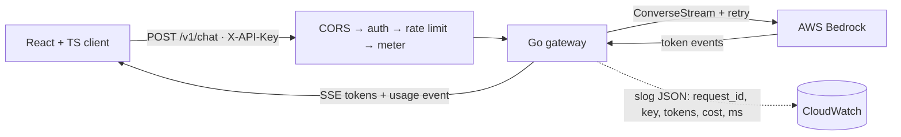

# infer-gateway


A containerized Go service that sits in front of AWS Bedrock and adds the production operations layer
around LLM inference: streaming responses, per-key API auth, per-key rate limiting, retries with
backoff, and per-request token and cost accounting, all observable through structured logs. It ships
with a React and TypeScript client that streams from the gateway in the browser and makes every one of
those features visible on screen.

> Live gateway: `<https://your-live-url>` · Live client: `<https://your-client-url>`
>
> ```bash
> curl -N -X POST https://your-live-url/v1/chat \
>   -H "X-API-Key: <key>" -H "Content-Type: application/json" \
>   -d '{"prompt":"Explain a token bucket rate limiter in two sentences."}'
> ```

## Project status

Built local-first, phase by phase. This README describes the full target system; the
sections below marked *(planned)* land in later phases.

**Done (Phase 1):** HTTP server on `net/http` (Go 1.22 routing), `GET /health` and
`GET /ready`, one structured `slog` JSON line per request (`request_id`, `method`,
`path`, `status`, `latency_ms`), and CORS with preflight handling.

**Done (Phase 2):** `POST /v1/chat` calls AWS Bedrock (Converse API) for a non-streaming
completion, meters token usage into a per-request `cost_usd`, and logs it, all behind a
`Generator` interface (fake in tests, real client in `main`). The request context threads
into the SDK call, so a client disconnect cancels the upstream request. Walkthrough and
interview notes: [`content/phase-2/`](./content/phase-2/README.md). Run it locally:

```bash
export AWS_REGION=us-east-1                    # region where Bedrock model access is enabled
export BEDROCK_MODEL_ID=us.anthropic.claude-haiku-4-5-20251001-v1:0  # optional; this is the default
export API_KEYS=testkey                         # comma-separated valid keys; the server refuses to boot without at least one
go run ./cmd/server
curl -s -X POST http://localhost:8080/v1/chat \
  -H "X-API-Key: testkey" -H "Content-Type: application/json" \
  -d '{"prompt":"say hello in five words"}'
# => {"text":"...","tokens_in":13,"tokens_out":13,"cost_usd":0.000078,"latency_ms":842}
```

**Done (Phase 3):** every request to `POST /v1/chat` is authenticated by the `X-API-Key`
header against a set loaded from `API_KEYS`. A missing or unknown key is rejected with
`401` in middleware, before any Bedrock call; a valid key is attached to the request
context and appears in the per-request log line, so cost is attributable per caller. Auth
wraps only the chat route, so the `/health` and `/ready` probes stay open.

**In progress:** SSE streaming (Phase 4), per-key rate limiting (Phase 5), retries with
backoff + jitter and tests (Phase 6), the React/TS client (Phase 7), and AWS deploy via
Docker + Terraform + ECS (Phases 8-9).

## The problem

Raw Bedrock gives you a model endpoint and nothing else. It has no notion of *your* API keys, no
per-caller rate limiting, no cost attribution, and no request-level observability. Put anything real in
front of it and you need that operations layer. `infer-gateway` is that layer: a thin, fast Go service
that authenticates callers, protects the backend, retries the failures worth retrying, meters what each
request costs, and streams the answer back token by token. The web client proves it end to end in a
browser.

## Architecture



Every request flows through a chain of composable middleware. Cross-cutting concerns (CORS, auth, rate
limiting, logging, metering) each wrap the next, so the handler stays a thin piece of orchestration and
each concern is testable in isolation. The Bedrock client sits behind a Go interface, so handlers can be
tested with a fake and models swapped without touching handler code.

## What it does

- `POST /v1/chat` streams a Bedrock completion back token by token over Server-Sent Events, ending with
  a `usage` event carrying the request's token counts, cost, and latency.
- Authenticates every request by API key and rejects unknown keys with `401`.
- Rate-limits per key with a token bucket, returning `429` and a `Retry-After` header when a key exceeds
  its rate.
- Retries transient Bedrock failures with exponential backoff and jitter, and only transient ones, while
  respecting client cancellation.
- Meters token usage and cost per request and logs one structured JSON line per request.
- `GET /health` and `GET /ready` for liveness and readiness.
- A React and TypeScript client that streams the response live, cancels an in-flight request with a Stop
  button, and surfaces the auth, rate-limit, and cost states.

## Quickstart

Prerequisites: Go 1.22+, Node 20+, Docker, and Bedrock model access enabled for a Converse-stream model
in your region.

Run the gateway:

```bash
docker build -t infer-gateway .
docker run -p 8080:8080 \
  -e AWS_REGION=us-east-1 \
  -e API_KEYS=testkey \
  infer-gateway
```

Stream a completion:

```bash
curl -N -X POST http://localhost:8080/v1/chat \
  -H "X-API-Key: testkey" -H "Content-Type: application/json" \
  -d '{"prompt":"Explain a token bucket rate limiter in two sentences."}'
```

Run the client:

```bash
cd web
npm install
echo "VITE_API_BASE=http://localhost:8080" > .env
npm run dev
```

## The stack, and why each choice

- Go with the standard `net/http` (1.22 routing) and `log/slog`. Production-grade without a framework,
  and structured logs are queryable in CloudWatch.
- Server-Sent Events, not WebSockets, for streaming. The data flows one direction, server to client, and
  SSE is plain HTTP, so it works through load balancers and `curl` with no handshake.
- `fetch` with `ReadableStream` on the client, not `EventSource`. `EventSource` only issues `GET`
  requests, and `/v1/chat` is a `POST` with a JSON body.
- In-memory rate limiting. A single task makes per-key limiters correct and defensible. Redis is the
  multi-task answer, listed below.
- Retry only transient errors (throttling, transient 5xx), never 4xx. Retrying a bad request just wastes
  calls. Backoff with jitter avoids a thundering herd.
- Multi-stage Docker build shipping a distroless binary for a small image and attack surface.
- Terraform for the AWS resources and GitHub Actions building and pushing the image to ECR, deployed on
  ECS Express Mode.

## Cost accounting

Each Converse response carries input and output token counts. The meter multiplies those by a per-model
price table to compute `cost_usd` per request, which is logged and returned to the client in the `usage`
event. One request logs as:

```json
{"request_id":"...","key":"testkey","model":"...","tokens_in":18,"tokens_out":64,"cost_usd":0.0021,"latency_ms":840}
```

> Add a screenshot or GIF of the client streaming and cancelling, and of a `429` firing under load, once
> you have run it. Insert real measured numbers here rather than the illustrative values above.

## Related projects

Part of a portfolio arc that moves from building an AI capability, to composing it, to operating it.

- [go-rag-api (Citely)](https://github.com/Go-Santiago-Go/go-rag-api): a Go RAG service on Bedrock. You
  can build the core AI capability.
- doc-agent (planned): a Strands agent that will consume Citely's `/query` as a tool, to demonstrate
  composing capabilities into a system.
- infer-gateway (this repo): the serving, scaling, and observability layer in front of inference, with a
  typed client that exercises it. You can operate it like a production engineer and work across the stack.

Concrete tie-in: Citely's generation call could itself sit behind this gateway, so the same Bedrock
traffic that powers the RAG service would be rate-limited, retried, and cost-metered by this
infrastructure.

## What I'd add next

- Request batching for a non-streaming `/v1/batch` path.
- OpenTelemetry tracing with spans across `auth → ratelimit → bedrock → stream`.
- Redis-backed rate limiting so limits hold across multiple tasks.
- A `/metrics` Prometheus endpoint (RPS, p50/p95 latency, `429` rate, retry count).
- Multi-provider routing behind one interface, and semantic response caching.
- On the client: a request-history panel with a spend ledger and per-key usage charts.
