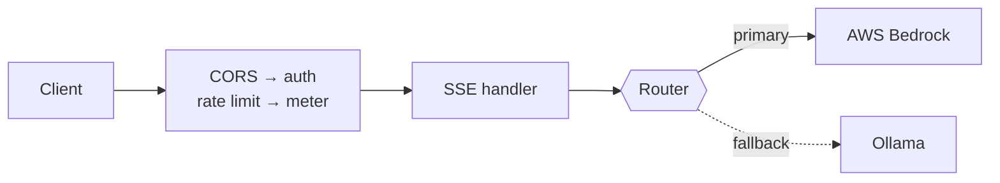
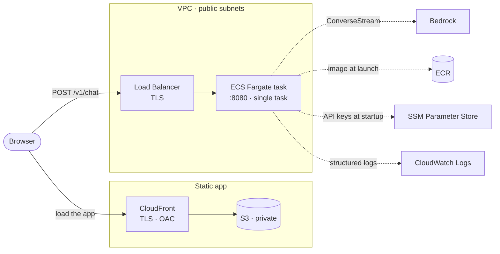

# LLM Inference Gateway: Streaming, Rate Limiting, Multi-Provider Failover, and Observability

[](https://github.com/Go-Santiago-Go/inference-gateway/actions/workflows/ci.yml)
[](https://github.com/Go-Santiago-Go/inference-gateway/actions/workflows/deploy.yml)
[](LICENSE)

This repository is a deployed Go service that puts the production operations layer in front of LLM
inference, using:

- **Server-Sent Events** token streaming relayed with `http.Flusher`, cancellable mid-stream
- **Per-key API-key auth**, rejected in middleware before any model call is made
- **Per-key rate limiting** with a token bucket, returning `429` plus an accurate `Retry-After`
- **Retries with exponential backoff and jitter**, on transient upstream failures only
- **Multi-provider routing** with ordered fallback and a **per-backend circuit breaker**
- **Per-request token and cost metering**, priced by the model that actually answered
- **Prometheus metrics** and a Grafana dashboard, both provisioned from files in this repo
- **AWS Bedrock** as the primary backend and **Ollama** as a free local fallback
- **Terraform** for the infrastructure, **GitHub Actions** over OIDC for CI/CD, **ECS Express Mode on
  Fargate** for the compute

Every one of those concerns fires on a single request:

> A caller sends a chat request → the gateway authenticates them → holds them to a per-key rate →
> streams the answer back token by token → fails over to a second provider if the first is broken →
> records exactly what the request cost and which model earned it.

## Contents

| | |
|---|---|
| [Demo](#demo) | A scripted run against live Bedrock: streaming, multi-turn context, and a real `429` |
| [The problem](#the-problem) | What a raw Bedrock endpoint does not give you, and what the layer in front has to get right |
| [How it works](#how-it-works) | The middleware chain, the one interface every backend sits behind, where failover stops, and the deployed shape on AWS |
| [Quickstart](#quickstart) | Clone to streaming tokens, then the whole stack including Grafana |
| [Trade-offs](#trade-offs) | Every design decision, what it was chosen over, and why |
| [Results](#results) | Benchmarked overhead, throughput, and image size, and what is verified on AWS |
| [What I'd do differently](#what-id-do-differently) | Four things a second pass would change |
| [Known gaps and next steps](#known-gaps-and-next-steps) | Deliberately out of scope, named rather than hidden |
| [Repo layout](#repo-layout) · [Documentation](#documentation) | Where each package lives, and the five deep-dive docs |

## Demo

![The inference-gateway client running a three turn thread. A question about retries, circuit
breakers and failover routing is typed, the answer streams back token by token, and a metrics strip
lands beneath it reading 56 tokens in, 107 tokens out, $0.0006, 1918 ms. A follow up referring back to
that answer streams in turn, and its strip reads 183 tokens in, because the whole conversation is
resent on every call. A third prompt is sent while the key's bucket is still empty, and the gateway
rejects it with a rate-limited banner counting down the Retry-After it returned. The conversation
total stays at two turns, because the rejected request never reached a model](docs/demo.gif)

Recorded against live Bedrock, so the latency and the token counts are that run's own. The jump from
56 to 183 tokens in is the gateway being stateless: the client resends the full history each time, so
the second call carries the first exchange with it. The limiter is tightened to `RATE_LIMIT_RPS=0.03`
and `RATE_LIMIT_BURST=2` for the recording, against defaults of `2` and `5`, so the rejection is
visible without a load generator. The `Retry-After` the banner counts down is the limiter's real
`Reserve().Delay()`, not a constant.

## The problem

A raw Bedrock endpoint has no per-caller identity, no throttling, no failover, and no answer to
"what is p95 right now." Every team calling it reimplements the same retry loop, and nobody can
attribute the bill. This is that layer, written once, in front of everything.

What that layer has to get right, and what each of those requirements costs if you get it wrong:

- **Reject before you spend.** Auth and rate limiting are decided in middleware, so a rejected request
  never reaches a paid API and a `429` costs nothing.
- **Degradation instead of failure.** A broken primary provider becomes a slower answer from a
  fallback, not a `502`.
- **Retry only where the operation is still idempotent.** Failover and retry cover the stream open
  and stop the moment tokens have reached the client.
- **Aggregate at write time.** Metrics answer "what is p95 right now" at a cost that does not grow
  with traffic, which matters most during an incident.
- **Cardinality is a security boundary.** No caller identity and no raw paths in metric labels, since
  `/metrics` is unauthenticated and any caller could otherwise mint unbounded series.
- **Dependency inversion at the boundary.** One `Generator` interface means the router, the breaker,
  and every backend compose without the handler knowing, and the whole pipeline tests with no cloud.

## How it works


```mermaid
flowchart LR
    C["Client"] --> MW["CORS → auth<br/>rate limit → meter"] --> H["SSE handler"] --> R{{"Router"}}
    R -->|"primary"| B["AWS Bedrock"]
    R -.->|"fallback"| O["Ollama"]
```

Tokens flow back along the same path as SSE frames, ending with a `usage` event.

Four ideas carry the design, each covered in depth in [docs/ARCHITECTURE.md](docs/ARCHITECTURE.md):

**Everything is a middleware chain.** CORS, auth, rate limiting, logging, and metering each wrap the
next, so the handler stays pure orchestration and every concern is testable alone. A `401` or a `429`
is decided before the handler runs, so neither ever reaches a backend.

**One interface, three implementations of it.** `provider.Generator` is the seam every backend sits
behind, in its own package so no backend imports another. The Bedrock and Ollama clients implement it.
So does `breaker.Breaker`, which stops calling a backend after repeated failures. So does
`router.Router`, which holds an ordered list of them and serves the first that succeeds. A `Generator`
wrapping a `Generator` inside a `Generator` holding `Generator`s, and the handler still receives
exactly one. `cmd/server/main.go` is the only file that names a concrete backend.

**Failover covers the stream open, never mid-completion.** Once tokens have reached the browser, no
second generation would continue the first, so a mid-stream failure ends the stream rather than
silently contradicting what the user already read. The retry loop stops at the same boundary.

**Context propagation is load-bearing.** The request context threads from handler through `Generator`
into the SDK call, so a client disconnect or a Stop button press cancels the in-flight Bedrock call
and the retry loop instead of paying for tokens nobody reads.

| Endpoint | Auth | Purpose |
|---|---|---|
| `POST /v1/chat` | `X-API-Key` | Streams a completion token by token over SSE, ending with a `usage` event carrying token counts, cost, latency, and the model that served it |
| `GET /health` · `GET /ready` | none | Liveness and readiness probes |
| `GET /metrics` | none | Traffic, latency, time to first token, token throughput and metered spend, in the Prometheus exposition format |

A React and TypeScript client (`client/`) streams from the gateway in a browser, so each of these
features is visible on screen rather than only in a log line.

Deployed, that pipeline is one Fargate task behind a load balancer, with the client served separately
as a static bundle:


```mermaid
flowchart LR
    user(["Browser"])

    subgraph edge["Static app"]
        cf["CloudFront<br/>TLS · OAC"] --> s3[("S3 · private")]
    end

    subgraph vpc["VPC · public subnets"]
        alb["Load Balancer<br/>TLS"] --> task["ECS Fargate task<br/>:8080 · single task"]
    end

    user -->|"load the app"| cf
    user -->|"POST /v1/chat"| alb
    task -.->|"ConverseStream"| bedrock["Bedrock"]
    task -.->|"image at launch"| ecr[("ECR")]
    task -.->|"API keys at startup"| ssm["SSM Parameter Store"]
    task -.->|"structured logs"| cw["CloudWatch Logs"]
```

Solid edges are what a browser does, load the app from CloudFront and then call the API through the
load balancer; dashed are the task's own outbound calls. Two details in that picture are consequences
of decisions above rather than incidental. The browser talks to **two origins**, CloudFront for the
app and the load balancer for the API, which is why Terraform wires the gateway's CORS allowlist to
the distribution's domain at apply time. And it is a **single task** on purpose: the token buckets
live in that task's memory, so scaling out would split each key's budget across tasks and the limit
would stop meaning what it says. Both Terraform stacks, the deploy walkthrough, teardown, and the
three constraints Express Mode imposes are in [docs/DEPLOYMENT.md](docs/DEPLOYMENT.md).

## Quickstart

Local first. The Go service runs natively against Bedrock, so there is no database and no container
needed to see the full request path. You need AWS credentials with
[Bedrock model access](https://docs.aws.amazon.com/bedrock/latest/userguide/model-access.html) enabled
for a Claude model in your region.

```bash
git clone https://github.com/Go-Santiago-Go/inference-gateway.git
cd inference-gateway

export AWS_REGION=us-east-1
export API_KEYS=testkey        # the server refuses to boot without at least one key
make run                       # listens on :8080
```

Both variables can live in a gitignored `.env` instead; the Makefile loads one if it is there.

```bash
# -N disables curl buffering so tokens print as they arrive
curl -N -X POST localhost:8080/v1/chat \
  -H "X-API-Key: testkey" -H "Content-Type: application/json" \
  -d '{"messages":[{"role":"user","content":"say hello in five words"}]}'
# data: Hello,
# data:  how are you today
# data: ?
# event: usage
# data: {"tokens_in":14,"tokens_out":10,"cost_usd":0.000064,"latency_ms":1667,"model":"us.anthropic.claude-haiku-4-5-20251001-v1:0"}
```

The whole stack, including the fallback backend and a Grafana with the dashboard already loaded:

```bash
make up                      # gateway, Ollama, Prometheus, Grafana
make ollama-pull             # one time, about 2 GB
open http://localhost:3000   # Grafana, nothing to click
```

`make help` lists the rest: `test`, `lint`, `bench`, the client targets, and the deploy and destroy
pair. Full environment variable reference, the web client, and the container path are in
[docs/LOCAL_DEV.md](docs/LOCAL_DEV.md). To stand it up on AWS, see
[docs/DEPLOYMENT.md](docs/DEPLOYMENT.md).

## Trade-offs

I optimized every choice below for one constraint: the simplest component that satisfies the
requirement, reaching for managed or heavyweight infrastructure only where the workload genuinely
demands it. The decisions that are not load-bearing sit behind interfaces, so they can change later
without disturbing the core.

| Decision | Choice | Why | Also considered |
|---|---|---|---|
| Token streaming | SSE over plain HTTP | Flow is one-directional server to client; plain HTTP works through ALBs and `curl` with no handshake | WebSockets |
| Client stream read | `fetch` + `ReadableStream` | `EventSource` only issues `GET`; `/v1/chat` is a `POST` with a JSON body | `EventSource` |
| Rate limiting | In-memory token bucket per key | A single task makes per-key limiters correct and defensible, with zero extra infrastructure | Redis, leaky bucket, sliding window |
| Rate-limit state | In-process (`sync.Map` of limiters) | No database in the MVP; the multi-task answer is Redis, and it is a stretch item | Redis-backed shared state |
| Retries | Backoff + jitter, transient only | Retrying a `4xx` just wastes calls; jitter avoids a thundering herd on the backend | Retry everything, fixed backoff |
| Retry ownership | Own loop, SDK retryer disabled | Two retryers nest to 9 calls per request on stacked schedules; one explicit loop keeps call counts predictable | Tune the SDK's `retry.Standard` |
| Bedrock access | Behind a `Generator` interface | Handlers test against a fake with no AWS, and models swap without touching handler code | Call the SDK directly |
| Interface location | Own package (`internal/provider`), not the Bedrock package | Go satisfies interfaces implicitly, so no backend needs to import another; only `main` names a concrete one | Leave `Generator` in `internal/bedrock` |
| Multi-provider routing | Router that implements `Generator` itself | Adding a backend never touches handler code, and the router names no concrete provider | A provider switch inside the handler |
| Fallback provider | Ollama, running locally | Free, needs no second API key, and anyone who clones the repo can run the whole failover demo | A second paid cloud vendor |
| Ollama client | `net/http` + `encoding/json`, no SDK | The protocol is one POST and a JSON decode loop; a dependency costs more in churn than it saves | The official Ollama Go client |
| Stream failover | Open only, never mid-completion | Tokens already reached the client, and a second generation would not continue the first | Reconnect and resume on a new backend |
| Failure isolation | Circuit breaker per backend | Failover alone pays the dead provider's timeout on every request and keeps hammering it while it is down | Failover with no breaker |
| Breaker cooldown | Computed on read, no timer | No goroutine per breaker and no shutdown path; the first caller after the cooldown becomes the probe | A `time.AfterFunc` per breaker |
| Cancelled requests | Never count as backend failures | Otherwise a burst of users hitting Stop trips the breaker and takes a healthy provider offline | Count every non-nil error |
| Cost attribution | Priced by the model that answered | With a router the model is a runtime fact; pricing a free fallback at the primary's rate invents spend | Price by the configured model |
| Cross-cutting concerns | Middleware chain | Auth, limits, metering, and logging each stay testable in isolation and the handler stays thin | Logic inside handlers |
| Compute | ECS Express Mode on Fargate | Managed networking, load balancing, and scaling from an image; App Runner is closed to new customers | Full ECS Fargate |
| Metrics alongside logs | Prometheus counters and histograms | Aggregating at write time answers "what is p95 right now" at constant cost; from logs the same question costs work proportional to traffic, and is slowest during an incident | Query the logs, CloudWatch EMF |
| Latency distributions | Histogram, not Summary | Bucket counters sum across instances, so a fleet-wide p95 is computable; per-instance precomputed quantiles cannot be averaged | Prometheus `Summary` |
| Per-key attribution | Logs only, never a metric label | Series count grows with the customer list and never shrinks, and `/metrics` is unauthenticated, so a key label would leak credentials to any scraper | `api_key` label on the cost counter |
| Route label | Allowlist, unknown paths collapse to `other` | Labelling with the raw path lets any caller mint unbounded series, turning monitoring into a denial of service vector | Raw `r.URL.Path` |

The pattern under all of it is **dependency inversion at the boundaries**: the request path depends on
a `Generator` interface, and the concrete backends plug in at `main`. That is what lets the whole
pipeline be tested with a fake generator and no cloud, and it is why the router and the circuit
breaker could be added as two more implementations of the same interface rather than as edits
scattered through the handler.

Go with no framework (`net/http` 1.22 routing, `log/slog`), AWS Bedrock and Ollama for inference,
Prometheus and Grafana for metrics, React and TypeScript on Vite for the client, and Docker,
Terraform, and GitHub Actions to build, provision, and ship it.

## Results

| | Measured |
|---|---|
| Gateway serving overhead | **~23 µs/request** single-threaded, ~4.6 µs aggregate under 16-way concurrency |
| Throughput ceiling of the pipeline itself | **~43K req/s** single-threaded, ~220K req/s at 16-way |
| Rate-limit enforcement | **~223 ns/request**, 160 B and 3 allocs, before any upstream call |
| Deployed image | **8.6 MB** compressed, distroless, runs as `nonroot` |

Measured with Go benchmarks against a fake `Generator`, so the numbers are the pipeline's own cost
with no network and no model latency in them. Reproduce with `go test -bench`
([how](docs/OPERATIONS.md#performance)).

Verified end to end, not just locally: the gateway runs on ECS Express Mode on Fargate and the client
on S3 behind CloudFront, both provisioned by the Terraform in this repo, with GitHub Actions pushing
images to ECR over OIDC. The Prometheus endpoint and the Grafana dashboard were exercised against live
Bedrock traffic. The demo above is a scripted run against that same path, so its latency and token
counts are real rather than illustrative.

## What I'd do differently

Four things I would change on a second pass, separate from the scoping calls below. These are
hindsight, not parked work.

**Check the SDK's retry behavior before writing any of my own.** The AWS SDK retries by default, so a
hand-written loop around it nests two schedules and one logical request can reach Bedrock up to nine
times. The fix is one line, `config.WithRetryMaxAttempts(1)`, but the failure mode is invisible until
you count calls, and a retry bug that only shows up during an upstream incident is the worst kind.

**Put `/metrics` on a separate admin port from the start.** It is unauthenticated on the main port
here. Moving it later is not a code change, it is a load balancer and task definition change, which
makes it exactly the kind of thing that stays wrong.

**Weigh Express Mode against full ECS Fargate knowing teardown is not clean.** Express Mode creates
and owns its load balancer, so `terraform destroy` cannot remove it and every teardown leaves an
orphaned ALB to delete by hand. It bought real simplicity in the service definition and I would still
probably choose it, but I would choose it with that cost priced in rather than discovered.

**Decide how metrics leave the deployed task before provisioning it.** Prometheus pulls, which needs
per-instance reachability, and the deployed gateway sits behind a load balancer that round-robins the
scrape. That is a deployment topology question, not an instrumentation question, and answering it
first would have pointed at Amazon Managed Service for Prometheus or a push path rather than a local
scrape.

## Known gaps and next steps

Deliberately out of scope, named rather than hidden. Each has a real answer I would reach for if the
workload demanded it, and each is a scoping call I can defend.

**Single-task correctness, by design.** Rate-limit state is in-process, which is globally correct only
while one task serves traffic; scaling out splits each key's budget across tasks. Circuit breaker
state is per task for the same reason, so with *n* tasks a failing provider absorbs up to *n* times
the failure threshold before every circuit opens. Both have the same answer, Redis-backed shared
state, and both are correct and defensible for the single task this actually deploys. Choosing
in-memory first was the point: it is the simplest thing that is genuinely correct at this scale.

**There is no spending cap.** The limiter meters requests per second, and cost is driven by tokens per
second, so it bounds spend only when request size is also bounded, and nothing here bounds request
size. Two requests per second of small prompts is a few dollars a day; two per second of 100K-token
prompts is four figures. A real cap needs a second bucket metered in tokens per minute, debited by the
usage the meter already computes. The accounting half exists, since every response is priced by the
model that answered; the enforcement half is not built. Durable per-key dollar budgets that survive a
restart need state this deliberately does not have.

**Failure detection is passive, not probed.** The breaker learns a provider is down from real requests
failing, so the first few callers after an outage pay the latency. Active health checks on an interval
would catch it before a user does, at the cost of a background loop and synthetic traffic against a
paid API.

**No admin API.** Limits, budgets, and provider config are environment variables read at startup, so
changing one is a redeploy. Hot reload and a control endpoint are the natural next step and are also
where an unauthenticated mistake becomes a real vulnerability, which is why it is not a casual add.

**Observability stops at metrics.** OpenTelemetry tracing is parked: metrics answer "what is p95 right
now," and tracing answers "where did this one request spend its time," which is the more useful
question only once there are more hops than this has. The scrape topology, the unauthenticated
`/metrics` port, and why percentiles here are estimates are all in
[docs/OPERATIONS.md](docs/OPERATIONS.md#honest-constraints).

**The deployed task runs single backend.** `OLLAMA_URL` is unset on ECS, so the router degrades to a
list of one there. Running Ollama in the cloud means paying for an idle GPU task, which buys nothing
this project demonstrates. The full routing path runs locally from one `docker compose up`.

**No heartbeat frame on long stalls.** The ALB idle timeout is 60 seconds and Express Mode does not
expose it as a tunable. It is an idle timer that resets on each byte and streams finish in one to two
seconds, so it is never approached, but a model stalling that long before its first token would need
an SSE comment frame to hold the connection.

**Also parked:** request batching, semantic response caching, and tiered priority limits that let a
real-time request preempt a batch job.

## Repo layout

| Path | Contents |
|---|---|
| `cmd/server/` | Wires middleware, backends, and handler, then starts the server. The only package naming a concrete backend. |
| `internal/provider/` | The `Generator` interface and its neutral request/response types. No implementations. |
| `internal/bedrock/` | AWS Bedrock backend: Converse and `ConverseStream`, plus the retry loop with backoff and jitter. |
| `internal/ollama/` | Ollama backend, over `net/http` and `encoding/json` with no SDK. |
| `internal/router/` | Ordered multi-backend fallback. Implements `Generator` itself. |
| `internal/breaker/` | Per-backend circuit breaker with a half-open probe. Implements `Generator` itself. |
| `internal/handler/` | The `/v1/chat` SSE relay and the probes. Thin by design. |
| `internal/middleware/` | CORS, auth, per-key rate limiting, logging, metrics. |
| `internal/meter/` | Token counts times a per-model price table, producing `cost_usd`. |
| `internal/metrics/` | Prometheus collectors and the route-label allowlist. |
| `client/` | React + TypeScript (Vite) client that exercises the gateway in a browser. |
| `infra/` | Terraform. `infra/bootstrap/` is the free persistent stack; `infra/` is the billable app stack. |
| `observability/` | Prometheus scrape config and provisioned Grafana datasource and dashboard. |
| `docs/` | Architecture, API reference, local development, deployment, operations. |
| `Makefile` | Task runner. Same verbs as the other repos in this portfolio; `make help` lists them. |

## Documentation

| Doc | What is in it |
|---|---|
| [docs/ARCHITECTURE.md](docs/ARCHITECTURE.md) | The middleware chain, the `Generator` composition, failover and breaker boundaries, and how the web client maps to backend capabilities |
| [docs/API.md](docs/API.md) | Endpoint reference, status codes, cost accounting, rate-limiter behavior under load, and the retry classification and schedule |
| [docs/LOCAL_DEV.md](docs/LOCAL_DEV.md) | Running it locally, every environment variable, the client, the Compose stack, tests and benchmarks |
| [docs/DEPLOYMENT.md](docs/DEPLOYMENT.md) | What gets provisioned on AWS, both Terraform stacks, a step by step deploy, teardown, and troubleshooting |
| [docs/OPERATIONS.md](docs/OPERATIONS.md) | The collectors, a PromQL reference for every panel, forcing a failover on purpose, benchmarks, and the cardinality decisions |
| [docs/CONVENTIONS.md](docs/CONVENTIONS.md) | How the docs are structured, and the accuracy guards every claim in them has to survive |

## License

MIT. See [LICENSE](LICENSE).
