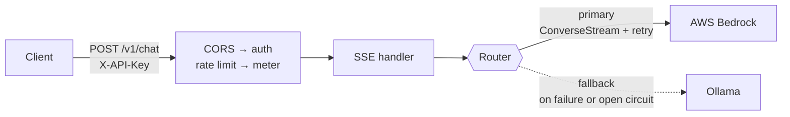
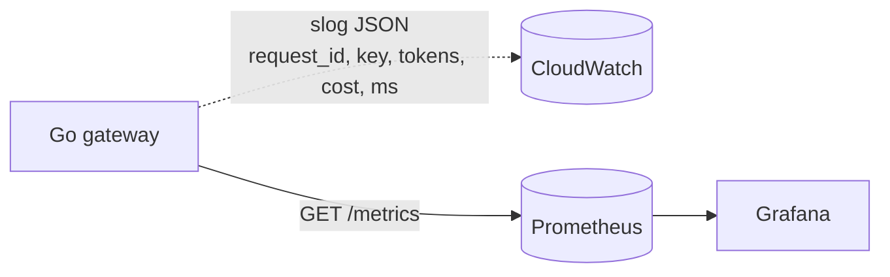

# Architecture

How the gateway is put together and why. The README carries the summary; this is the depth behind it.

## The request path



Token events travel back along the same path, relayed as SSE `data:` frames and closed by a final
`usage` event. A `401` or a `429` is decided in the middleware chain and never reaches the router.

## The observability path

Separate from the request path, and deliberately two channels rather than one.



Logs are per-event and carry caller identity, so they answer "what happened to request `9f2c`".
Metrics are pre-aggregated and carry none, so they answer "what is p95 right now" at a cost that does
not grow with traffic. See [OPERATIONS.md](OPERATIONS.md).

## Everything is a middleware chain

Every request runs through a chain of composable middleware. Cross-cutting concerns (CORS, auth, rate
limiting, logging, metering) each wrap the next, so the handler stays a thin piece of orchestration
and each concern is testable in isolation.

This is the spine of the service. Auth, limits, cost metering, and logging live in
`internal/middleware`, never inside handlers. A `401` for an unknown key and a `429` for an exhausted
bucket are both decided before the handler runs, which is what makes them cheap: neither ever reaches
a backend.

The composition, outermost first:

```
Metrics → Logging → CORS → mux → auth → rate limit → handler
```

The order is load bearing in three places. `Metrics` and `Logging` are outermost so they wrap every
request including the preflight `OPTIONS` that CORS short-circuits, and so their latency covers the
whole chain rather than the handler alone. `auth` and `rate limit` wrap only the `/v1/chat` route,
which is what keeps a rejection off the backend. And `GET /metrics` is registered on a separate outer
mux **above** the instrumented chain, so a scrape needs no API key, does not count itself as gateway
traffic, and emits no log line. Preserve all three when changing the chain.

## One interface, three implementations of it

`provider.Generator` is the seam every backend sits behind, and it lives in its own package so no
backend imports another. Go satisfies interfaces implicitly, so the interface does not need to live
next to an implementation, and only `cmd/server/main.go` names a concrete one.

- The **Bedrock** and **Ollama** clients implement it.
- So does `breaker.Breaker`, which wraps one backend and stops calling it after repeated failures.
- So does `router.Router`, which holds an ordered list of them and serves the first that succeeds.

A `Generator` wrapping a `Generator` inside a `Generator` holding `Generator`s, and the handler still
receives exactly one. Adding a provider is a wiring change in `main` and nothing else.

The pattern under all of it is **dependency inversion at the boundaries**: the request path depends on
an interface, and the concrete backends are plugged in at `main`. That is what lets the whole pipeline
be tested with a fake generator and no cloud access, and it is why the router and the circuit breaker
could be added as two more implementations of the same interface rather than as edits scattered
through the handler.

## Failover covers the open, not the stream

Once a stream is relaying, tokens have already reached the browser, and no second generation would
continue the first. So a mid-completion failure ends the stream rather than silently switching
providers and contradicting what the user already read. The retry loop inside the Bedrock client stops
at the same boundary for the same reason.

The retry boundary belongs where the operation is still idempotent from the client's point of view.

## Why a breaker on top of failover

Failover alone still pays the failing backend's full timeout on every request, so an outage becomes
sustained latency rather than fast degradation, and the struggling provider keeps receiving the
traffic that is keeping it down. After five consecutive failures the breaker stops calling it for 30
seconds, then admits exactly one probe to test recovery.

The cooldown is computed on read rather than driven by a timer, so there is no goroutine per breaker
and no shutdown path; the first caller after the cooldown elapses becomes the probe.

**A cancelled request never counts as a failure.** Otherwise a burst of users hitting Stop would trip
the breaker and take a healthy provider out of service.

## Streaming without burning tokens

`POST /v1/chat` relays Bedrock `ConverseStream` events onto a channel, and the handler writes each as
a `data:` frame flushed immediately with `http.Flusher`, then emits a final `event: usage` frame.

**Context propagation is load-bearing.** The request context threads from the handler through the
`Generator` into the SDK call, so a client disconnect (or the client's Stop button) cancels the
in-flight Bedrock call and the retry loop instead of paying for tokens nobody reads. Preserve this
wiring in any change to the request path.

## Cost is attributed to the model that answered

The meter reads `Completion.Model` / `Chunk.Model`, not the handler's configured model ID. With a
router in front, which backend answered is a runtime fact, and pricing a free local fallback at
Bedrock's rate would report spend that never happened.

## The web client

The gateway's features are invisible by default: streaming, cancellation, per-key auth, rate limiting,
and cost accounting all happen inside the box. The client (`client/`, Vite + React + TypeScript) is a
lens where each piece of the UI maps to one real backend capability, so the gateway can be *watched*
working rather than taken on faith.

| What you see | Backend capability |
|---|---|
| Tokens appear one at a time with a blinking cursor | SSE streaming relayed with `http.Flusher` |
| A Stop button freezes the answer mid-stream | request-context cancellation into the Bedrock call |
| A wrong API key shows a clean unauthorized state | per-key auth middleware (`401`) |
| Sending too fast shows a rate-limited state | per-key token bucket (`429` + `Retry-After`) |
| Per-reply footer: tokens in/out, cost, latency | the `usage` event |
| A running conversation total | client-side accumulation of each turn's `usage` |

The last row is the point of the cost story: because the stateless gateway resends the full history
every turn, input tokens climb per turn, so a conversation costs more than the sum of its prompts in
isolation. The total makes that growth visible on screen.

Two implementation choices worth naming. The stream is read with `fetch` + `ReadableStream`, not
`EventSource`, because `EventSource` only issues `GET` and `/v1/chat` is a `POST` with a JSON body;
the client buffers network reads and splits them on the SSE frame delimiter itself. And the whole
request lifecycle is a TypeScript **discriminated union** (`idle | streaming | done | error`), so the
compiler enforces that every state is handled and an illegal state (say, cost before completion) is
unrepresentable. Model output is rendered with `react-markdown`, which is safe by default: it escapes
raw HTML and neutralizes `javascript:` URLs, and no `rehype-raw` is enabled, so no sanitizer is
needed.
