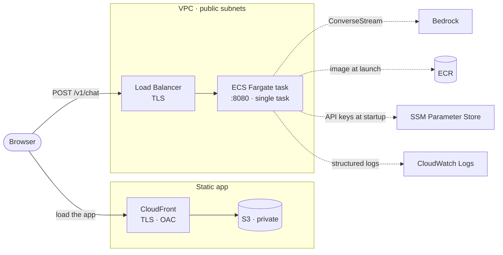

# Deploying inference-gateway to AWS

This walks through cloning the repo and standing up the whole system on AWS: a containerized Go
gateway in front of Amazon Bedrock on ECS Express Mode, and the React client on S3 behind CloudFront,
all provisioned with Terraform. At the end you get two public HTTPS URLs, an API that streams Bedrock
tokens over SSE and a browser app that talks to it.

Two warnings before you start. First, this creates **billable** resources, mainly the Express Mode
load balancer at roughly $0.02 per hour. It is cents for a short session, but you must tear it down
when done. Second, the local path (see [LOCAL_DEV.md](LOCAL_DEV.md)) is free and proves the same
request path, so deploy to AWS only when you actually want the cloud demo.

## What gets provisioned

I run the container on **Amazon ECS Express Mode on Fargate**: from an image plus three IAM roles,
Express Mode provisions the Fargate service, an internet-facing load balancer with TLS, autoscaling,
health checks, and the security-group wiring between the load balancer and the task, and hands back a
public `*.ecs.<region>.on.aws` URL. There is no database and no data tier: rate-limit state lives in
the task's memory, so the request path is just the load balancer and the app.

The React client is a static bundle, so I serve it separately: a private S3 bucket fronted by
CloudFront, reachable only through the distribution via an Origin Access Control. The browser
therefore talks to two origins, CloudFront for the app and the load balancer for the API, which is
why I wire the gateway's CORS allowlist to the distribution's domain at apply time.



The two solid paths are what a browser does: **load the app** from CloudFront, then **call the API**
through the load balancer into the ECS task. The dashed lines are the task's outbound calls. A
multi-stage Docker build ships a distroless binary (8.6 MB compressed) for a small image and attack
surface, and GitHub Actions builds and pushes it to ECR over GitHub OIDC, with no stored AWS
credentials.

The `infra/` directory holds two Terraform stacks, split by lifetime:

- **`infra/bootstrap/`** provisions the free, long-lived pieces: the ECR repository and the GitHub
  OIDC CI role. Apply it once and leave it up, so CI can push images at any time and images survive
  the app stack's teardown.
- **`infra/`** provisions the billable app stack: the ECS Express service and its infrastructure role,
  the task and execution roles, the API keys as an SSM `SecureString`, the CloudWatch log group, and
  the S3 and CloudFront hosting for the client. It looks the ECR repository up by name, so bootstrap
  must be applied first. This is the stack you destroy after each session.

The only meaningful cost while up is the Express Mode load balancer (roughly $0.02 per hour);
CloudFront and S3 fall inside the always-free tier at this scale, and there is no database. A
`destroy` after each session keeps the bill at pennies.

### Three constraints worth knowing up front

First, the ALB idle timeout is 60 seconds and Express Mode does not expose it as a tunable. In
practice streams finish in one to two seconds, and it is an *idle* timer that resets on each byte, so
it is never approached; a model that stalled longer than 60 seconds before its first token would need
a heartbeat comment frame, which is a stretch item rather than something built.

Second, the token-bucket limiters live in the task's memory, which is only globally correct while a
**single task** serves traffic; scaling out would split each key's budget across tasks, so multi-task
correctness needs shared state in Redis.

Third, Express Mode places the tasks in public subnets in order to give the load balancer a public
URL; the tasks have public IPs but stay unreachable because their security group admits only the load
balancer. Keeping them fully private would mean dropping to a hand-rolled `aws_ecs_service`.

## Prerequisites

- An AWS account, with the [AWS CLI](https://docs.aws.amazon.com/cli/latest/userguide/getting-started-install.html) configured (`aws configure`).
- [Terraform](https://developer.hashicorp.com/terraform/install), [Docker](https://docs.docker.com/get-docker/), and [Node 20+](https://nodejs.org) for the client build.
- **Bedrock model access.** In the Bedrock console, request access to a **Claude** model in your
  region. Bedrock is opt in per account, and the gateway returns `502` with `AccessDeniedException` in
  its logs until this is granted. See [Manage model access](https://docs.aws.amazon.com/bedrock/latest/userguide/model-access.html).
- Optional but wise: a [budget alert](https://docs.aws.amazon.com/cost-management/latest/userguide/budgets-create.html)
  at a few dollars so nothing surprises you.

## Step 1: Clone

```bash
git clone https://github.com/Go-Santiago-Go/inference-gateway.git
cd inference-gateway
```

## Step 2: Apply the persistent stack (free)

The infrastructure is split into two Terraform stacks by lifetime. The **bootstrap** stack holds the
free, long-lived pieces: the ECR container registry and the GitHub OIDC role CI uses to push images.
Apply it once and leave it up, so your images survive the app stack's teardown.

It needs two values. `github_repo` scopes the CI role's trust policy to your fork, and
`create_oidc_provider` decides whether to create the account's GitHub OIDC provider. That provider is
a per-issuer singleton: create it if your account has none, reuse it if another project already made
one. Check with:

```bash
aws iam list-open-id-connect-providers   # empty output means you need to create it
```

```bash
cd infra/bootstrap
cat > terraform.tfvars <<'EOF'
github_repo          = "your-user/inference-gateway"
create_oidc_provider = true   # false if the provider already exists
EOF

terraform init
terraform apply    # creates the ECR repo and the CI role; both are free
cd ../..
```

## Step 3: Get an image into ECR

The app stack deploys an image by tag, so ECR needs one before you deploy. You have two ways.

**Option A, build and push locally.**

```bash
ACCOUNT=$(aws sts get-caller-identity --query Account --output text)
REGION=us-east-1
REPO="$ACCOUNT.dkr.ecr.$REGION.amazonaws.com/inference-gateway"

docker build -t "$REPO:latest" .
aws ecr get-login-password --region $REGION \
  | docker login --username AWS --password-stdin "$ACCOUNT.dkr.ecr.$REGION.amazonaws.com"
docker push "$REPO:latest"
```

**Option B, let CI push it.** In your GitHub repo, add a repository variable `AWS_ROLE_ARN` (Settings,
then Secrets and variables, then Actions, then Variables) set to the `github_ci_role_arn` output from
Step 2. Then merge to `main`, and the `deploy` workflow builds the image and pushes it to ECR with no
stored AWS keys, using OIDC.

## Step 4: Apply the app stack

This provisions the ECS Express Mode service, the IAM roles, the API keys in SSM, the CloudWatch log
group, and the S3 and CloudFront hosting for the client, then waits until the service is healthy.
Budget about 10 to 15 minutes.

It needs your API keys: the comma-separated list the gateway authenticates against. There is no
default, deliberately, so the value is never in the repo. Pick anything unguessable.

```bash
cd infra
cat > terraform.tfvars <<'EOF'
api_keys = "pick-a-long-random-string"
EOF

terraform init
terraform apply

terraform output gateway_url    # the live API
terraform output client_url     # the hosted client (no assets in it yet)
```

Both `terraform.tfvars` files are gitignored.

## Step 5: Build and upload the client

The client is a static bundle, and the gateway's URL is compiled into it at build time, so this has to
happen after Step 4. The gateway already trusts the CloudFront origin: Terraform wired the
distribution's domain into the gateway's `CORS_ORIGINS` on apply.

```bash
cd ..
GATEWAY=$(terraform -chdir=infra output -raw gateway_url)
BUCKET=$(terraform -chdir=infra output -raw client_bucket)
DIST=$(terraform -chdir=infra output -raw client_distribution_id)

cd client && npm ci && VITE_API_BASE="$GATEWAY" npm run build && cd ..
aws s3 sync client/dist "s3://$BUCKET" --delete

# CloudFront caches aggressively; invalidate so a re-upload is served immediately.
aws cloudfront create-invalidation --distribution-id "$DIST" --paths '/*'
```

## Step 6: Test it

```bash
URL=$(terraform -chdir=infra output -raw gateway_url)
KEY="the value you put in api_keys"

# health
curl "$URL/health"        # {"status":"ok"}

# stream a completion (-N disables curl buffering so tokens print as they arrive)
curl -N -X POST "$URL/v1/chat" \
  -H "X-API-Key: $KEY" -H 'Content-Type: application/json' \
  -d '{"messages":[{"role":"user","content":"say hello in four words"}]}'
# data: Hello there, friend
# event: usage
# data: {"tokens_in":13,"tokens_out":7,"cost_usd":0.000048,"latency_ms":787}

# an unknown key is rejected before any Bedrock call
curl -o /dev/null -w '%{http_code}\n' -X POST "$URL/v1/chat" \
  -H 'X-API-Key: wrong' -H 'Content-Type: application/json' \
  -d '{"messages":[{"role":"user","content":"hi"}]}'
# 401
```

Then open the `client_url` in a browser, paste your key into the key field, and send a prompt. You
should see tokens stream in, a working Stop button, and the per-request cost in the metrics footer.

## Step 7: Tear it down

```bash
terraform -chdir=infra destroy    # removes the ECS service, ALB, CloudFront, and bucket
```

**Budget 25 to 40 minutes, and expect to run it more than once.** Teardown is slower than deploy, and
two resources dominate:

- **The ECS Express service** takes 20+ minutes, because deleting it also unwinds the load balancer,
  listeners, and security groups that Express Mode created for you. The Terraform provider waits 20
  minutes for the service to reach `INACTIVE` and then gives up with:

  ```
  Error: deleting ECS (Elastic Container) Express Gateway Service
  Cause: While waiting, timeout while waiting for state to become 'INACTIVE'
  (last state: 'DRAINING', timeout: 20m0s)
  ```

  **This is a provider timeout, not a failure.** AWS is still deleting; Terraform just stopped
  watching. Confirm with
  `aws ecs describe-services --cluster default --services inference-gateway --query 'services[0].status'`
  and simply run `terraform destroy` again. The second run picks up where the first stopped.

- **CloudFront** must be disabled before it can be deleted, which the provider does for you, but the
  disable-then-delete cycle takes several minutes on its own.

**The load balancer outlives `terraform destroy`, and you have to delete it yourself.** This is the
one that will quietly bill you. Express Mode creates a shared ALB (it consolidates up to 25 services
behind one) and tags it `AmazonECSManaged`. Because *ECS* owns it rather than your Terraform, deleting
the service does not delete the load balancer, and your state file has no record it ever existed. No
number of `terraform destroy` runs will remove it. Left alone it costs roughly $16 to $24 a month.

Verify you are actually at zero rather than trusting the command's exit code:

```bash
terraform -chdir=infra state list                                                            # expect empty
aws ecs list-services --cluster default                                                      # expect empty
aws elbv2 describe-load-balancers --query 'LoadBalancers[].LoadBalancerName' --output text   # expect empty
aws elbv2 describe-target-groups  --query 'TargetGroups[].TargetGroupName'  --output text    # expect empty
aws cloudfront list-distributions --query 'DistributionList.Items[].Id'     --output text    # expect None
```

If a load balancer is still listed once every ECS service is gone, it is orphaned. Delete it and the
target groups it leaves behind:

```bash
ALB=$(aws elbv2 describe-load-balancers --query 'LoadBalancers[0].LoadBalancerArn' --output text)
aws elbv2 delete-load-balancer --load-balancer-arn "$ALB"

# Target groups cannot be deleted until the listener is fully gone, which lags by
# a minute or two. Retry until they delete cleanly.
for TG in $(aws elbv2 describe-target-groups --query 'TargetGroups[].TargetGroupArn' --output text); do
  aws elbv2 delete-target-group --target-group-arn "$TG"
done
```

Do this only when no ECS service remains: if you plan to redeploy shortly, Express Mode will reuse the
existing load balancer instead of provisioning a new one.

This slow, imprecise teardown is the trade-off for the managed abstraction: Express Mode gives you a
Fargate service, an ALB, TLS, and autoscaling from a single resource, and in exchange you do not
control the lifecycle of the things it created for you.

Leave the bootstrap stack up: ECR and the CI role are free, and keeping them means CI can push images
at any time and your pushed image survives for the next deploy. If you want everything gone,
`terraform destroy` in `infra/bootstrap` too, though note that destroying the OIDC provider will break
any other project in the account that relies on it.

## Troubleshooting

- **`502` from `/v1/chat`, `AccessDeniedException` in the logs.** Bedrock model access is not granted
  in this region, or the task role cannot reach the model. Note that a model ID beginning `us.` is a
  cross-region inference profile: it needs permission on the profile *and* on the underlying
  foundation model in every region the profile routes to. `infra/iam.tf` grants all of these; if you
  changed the region, check the ARNs there. Read the real error with
  `aws logs tail /ecs/inference-gateway --since 10m`.
- **`terraform apply` fails creating the OIDC provider, "already exists".** Another stack in the
  account created it. Set `create_oidc_provider = false` in `infra/bootstrap/terraform.tfvars`.
- **CI fails at "Configure AWS credentials".** The `AWS_ROLE_ARN` repository variable is missing, or
  `github_repo` in the bootstrap stack does not match your fork, so the trust policy rejects the
  token.
- **The client loads but every request fails with a CORS error.** The bundle was built before the
  gateway existed, or against the wrong URL. Rebuild with `VITE_API_BASE` set to the current
  `gateway_url`, re-sync, and invalidate the CloudFront cache.
- **The client shows a stale version after re-uploading.** CloudFront cached it. Run the invalidation
  from Step 5.
- **`apply` errors that a resource already exists.** An earlier run left something behind. Reconcile
  with `terraform plan`, or import or delete the stray resource.
